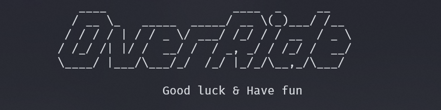

# OverRide



42 project which aims to strengthen our knowledge in reverse engineering.

OverRide is an ISO challenge slightly more complex than RainFall. You will have to dive deep into reverse engineering, learn to reconstruct a code, and understand it to detect faults. Will you reach the last level?

Since this is the third project of the security branch, we will be using the knowledge we acquired in the previous project, [SnowCrash](https://github.com/Assxios/SnowCrash) and [Rainfall](https://github.com/alexandre-hallaine/RainFall).

# Foreword

## Vision
For this project, we tried our absolute best to make our source files as accurate as possible. However, we couldn't always have the exact assembly code as the original binary. The following sources whom are not exactly the same as the original binary are:
- [level03/source.c](/level03/source.c)
- [level04/source.c](/level04/source.c)
- [level06/source.c](/level06/source.c)
- [level09/source.c](/level09/source.c)
> Although the source code is not exactly the same as the original binary, it still works the same way and will allow you to solve the challenge.

If you are able to make the source code more accurate, please feel free to open a pull request.

## Flags
In this project, you will need different flags for `gcc` to compile your own source code so that it matches the original binary. We have provided those flags at the top of every `source.c` file. However, let us remind you of them here:

- `-m32` : Compile for 32-bit architecture
- `-fno-stack-protector` : Disable stack canaries
- `-z execstack` : Allow execution on the stack (NX bit disabled)
- `-fpie -pie` : Enable PIE (Position Independent Executable)
- `-no-relro` : Disable RELRO (Relocation Read-Only)
- `-z now` : Full RELRO

I've ignored some flags that are not useful or already enabled by default. Here is the default security flags for `gcc`:
```bash
level09@OverRide:/tmp$ gcc main.c
level09@OverRide:/tmp$ checksec --file a.out
RELRO           STACK CANARY      NX            PIE             RPATH      RUNPATH      FILE
Partial RELRO   Canary found      NX enabled    No PIE          No RPATH   No RUNPATH   a.out
```

## Tools
We **only** used `GDB` for this project.  
We heavily recommend you to stick to reading the assembly code and understanding the stack with your own head, it will not only be much more rewarding, but it will also help you understand the concepts better.
> You could also not use any buffer overflow pattern generator for the more advanced of you.

## MADE WITH LOVE BY :

<!-- ALL-CONTRIBUTORS-LIST:START - Do not remove or modify this section -->
<!-- prettier-ignore-start -->
<!-- markdownlint-disable -->
<table>
  <tr>
    <td align="center"><a href="https://github.com/alexandre-hallaine/"><br /><sub><b>alexandre-hallaine (ahallain)</b></sub></a><br /><a href="https://profile.intra.42.fr/users/ahallain" title="Intra 42"></a></td>
    <td align="center"><a href="https://github.com/assxios/"><br /><sub><b>Assxios (droge)</b></sub></a><br /><a href="https://profile.intra.42.fr/users/droge" title="Intra 42"></a></td>
  </tr>
</table>
<!-- markdownlint-restore -->
<!-- prettier-ignore-end -->
<!-- ALL-CONTRIBUTORS-LIST:END -->